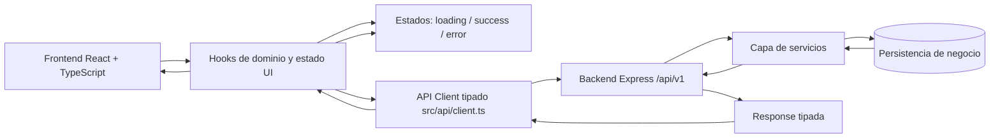

# Arquitectura de FlashLearn

## Objetivo de esta fase

Definir una arquitectura simple, escalable y tipada para frontend y backend, empezando por los componentes principales de la UI.

---

## Guia rapida de lectura

Si necesitas una vista rapida del documento, sigue este orden:

1. `Decisiones tecnicas (resumen)` para entender el marco general.
2. `Estrategia de estado` + `Hooks de dominio (MVP actual)` + `StudyPage` / `Verificacion Fase 4` + `Persistencia cliente/servidor` para saber donde vive cada dato y como validar el MVP.
3. `Reglas de sincronizacion` + `Diagrama de flujo de datos` para implementar sin inconsistencias.
4. `Convenciones de carpetas y tipos` para mantener coherencia en nuevos archivos.

---

## Mapa de componentes (frontend)

### Layout y navegación

- `AppShell`: layout principal de la app (header, navegación y contenedor de contenido).
- `MainNav`: barra de navegación con enlaces (`Inicio`, `Colecciones`, `Estudio`).
- `PageContainer`: wrapper común para márgenes, ancho máximo y espaciado vertical.

### UI base reutilizable

- `Button`: botón base con variantes (`primary`, `secondary`, `danger`, `ghost`).
- `Input`: campo de texto tipado para formularios.
- `Textarea`: campo largo para respuestas de tarjetas.
- `Select`: selector para colecciones y filtros.
- `Card`: contenedor visual reutilizable.
- `Modal`: diálogo para crear/editar elementos sin salir de la página.
- `EmptyState`: estado vacío para listas sin datos.
- `ConfirmDialog`: confirmación de acciones destructivas.

### Componentes de dominio (FlashLearn)

- `CollectionList`: lista de colecciones.
- `CollectionItem`: tarjeta/resumen de una colección.
- `CollectionForm`: formulario para crear/editar colección.
- `FlashcardList`: lista de tarjetas de una colección.
- `FlashcardItem`: vista resumida de tarjeta con acciones.
- `FlashcardForm`: formulario pregunta/respuesta.
- `StudyCard`: tarjeta en modo estudio (mostrar pregunta y revelar respuesta).
- `StudyControls`: acciones de estudio (anterior, siguiente, revelar, barajar).
- `ProgressIndicator`: progreso de sesión (`actual/total`).

### Páginas

- `HomePage`: portada y acceso rápido a flujos principales.
- `CollectionsPage`: CRUD de colecciones y navegación al detalle.
- `CollectionDetailPage`: CRUD de tarjetas dentro de una colección.
- `StudyPage`: modo repaso con navegación entre tarjetas.
- `NotFoundPage`: ruta 404.

---

## Composición por página

- `HomePage` -> `PageContainer` + accesos rápidos.
- `CollectionsPage` -> `PageContainer` + `CollectionList` + `CollectionForm` + `ConfirmDialog`.
- `CollectionDetailPage` -> `PageContainer` + `FlashcardList` + `FlashcardForm` + `ConfirmDialog`.
- `StudyPage` -> `PageContainer` + `StudyCard` + `StudyControls` + `ProgressIndicator`.

---

## Reglas de diseño de componentes

- Componentes de `src/components/ui` no conocen lógica de negocio.
- Componentes de `src/components/features` sí conocen el dominio (colecciones/tarjetas).
- Todo componente recibe `props` tipadas con interfaces de `src/types`.
- Mantener componentes pequeños: una responsabilidad principal por componente.
- Acciones de red y transformación de datos fuera de componentes (hooks/context/api client).

---

## Estructura sugerida de carpetas

```txt
src/
  components/
    ui/
      Button.tsx
      Input.tsx
      Card.tsx
      Modal.tsx
    features/
      collections/
        CollectionList.tsx
        CollectionItem.tsx
        CollectionForm.tsx
      flashcards/
        FlashcardList.tsx
        FlashcardItem.tsx
        FlashcardForm.tsx
      study/
        StudyCard.tsx
        StudyControls.tsx
        ProgressIndicator.tsx
  hooks/
    index.ts
    useCollections.ts
    useFlashcards.ts
  lib/
    storage/
      collectionsStorage.ts
      flashcardsStorage.ts
  pages/
    HomePage.tsx
    CollectionsPage.tsx
    CollectionDetailPage.tsx
    StudyPage.tsx
    NotFoundPage.tsx
  types/
    domain.ts
    async.ts
    api.ts
```

---

## Tipos de dominio base (referencia)

- `Collection`: `id`, `name`, `description`, `createdAt`, `updatedAt`.
- `Flashcard`: `id`, `collectionId`, `question`, `answer`, `tags[]`, `createdAt`, `updatedAt`.
- `StudySession`: `collectionId`, `order[]`, `currentIndex`, `revealed`.

---

## Estrategia de estado

La estrategia separa claramente tres capas: estado local de UI, estado global compartido y estado remoto (red/API).

### 1) Estado local (componente/pagina)

Usar `useState` para estado efimero y visual que no necesita compartirse globalmente:

- apertura/cierre de modales
- valor de inputs en formularios
- tabs seleccionadas
- orden local de una tabla/lista
- flags temporales como `isSubmitting` en un formulario puntual

Regla: si solo lo usa un componente o una pagina, queda local.

### 2) Estado global (Context API)

Usar `Context` para datos transversales que consumen varias paginas o componentes:

- `StudySessionContext`: sesion de estudio actual (coleccion activa, indice, revelar respuesta, barajar)
- `UIContext`: preferencias de interfaz (tema, densidad, filtros persistentes de vista)

Regla: si 3+ ramas de componentes necesitan el mismo dato y hay prop drilling, pasar a contexto.

### 3) Estado de red (server state)

La fuente de verdad para datos de negocio es el backend (`/api/v1`):

- colecciones
- tarjetas
- resultados de operaciones CRUD

Gestion en frontend:

- `loading`: solicitud en curso
- `error`: error recuperable de red o validacion
- `success/data`: datos confirmados por backend

Patron recomendado:

- `src/api/client.ts` para llamadas HTTP tipadas
- hooks de dominio en `src/hooks` (por ejemplo `useCollections`, `useFlashcards`)
- la UI nunca llama `fetch` directamente

### 4) Persistencia local (uso acotado)

`localStorage` queda solo para estado de experiencia de usuario, no para negocio:

- ultima coleccion abierta
- preferencia de orden de estudio
- flags UI (ejemplo: tutorial visto)

No guardar como fuente principal:

- lista completa de colecciones
- tarjetas canónicas

### 5) Flujo de actualizacion recomendado

1. Usuario ejecuta accion en UI (crear, editar, borrar).
2. Hook de dominio llama a `api/client.ts`.
3. Backend responde con entidad actualizada o error.
4. El estado de red se actualiza y la UI se re-renderiza.
5. Si aplica, se sincroniza una preferencia de UI en `localStorage`.

### 6) Criterios para decidir tipo de estado

- Si afecta solo al render de un componente -> estado local.
- Si coordina varias pantallas/componente -> contexto.
- Si representa negocio persistente -> backend/API.
- Si es preferencia del usuario y no rompe consistencia de negocio -> `localStorage`.

---

## Hooks de dominio (MVP actual)

### Ubicacion

- `src/hooks/useCollections.ts` — colecciones: carga, persistencia provisional y CRUD.
- `src/hooks/useFlashcards.ts` — flashcards globales o filtradas por coleccion.
- `src/hooks/index.ts` — reexportaciones; en paginas se importa desde `../hooks`.

### Tipado de red

- `src/types/async.ts`: `AsyncStatus` (`idle` | `loading` | `success` | `error`) y `AsyncState` (`status`, `error: string | null`).
- Los hooks exponen `network` para que la UI muestre carga, error y accion **Reintentar** (`refresh()`).

### Persistencia provisional

- `src/lib/storage/collectionsStorage.ts` y `flashcardsStorage.ts` encapsulan `localStorage` hasta sustituir por llamadas a `/api/v1`.
- Solo se guarda en disco cuando `network.status === 'success'`, para no pisar datos con un array vacio antes de terminar la carga inicial.

### Contrato resumido

| Hook | Parametros | Expone (principal) |
|------|------------|---------------------|
| `useCollections()` | — | `collections`, `network`, `refresh`, `create`, `update`, `remove` |
| `useFlashcards(collectionId?)` | id opcional | `flashcards`, `allFlashcards`, `network`, `refresh`, `create`, `remove` |

- Sin `collectionId`, `flashcards` devuelve todas las tarjetas (util en `StudyPage`). Con `collectionId`, la lista queda filtrada y `create` asocia la tarjeta a esa coleccion (`CollectionDetailPage`).

### Limitacion hasta Context o API unificada

Cada montaje del hook en una pagina mantiene su propio estado en React. Los datos en disco se actualizan al persistir; otra pestaña o vista puede releer con `refresh()` (por ejemplo `StudyPage` al recuperar el foco de la ventana). Cuando exista cliente HTTP unico o Context, la fuente de verdad pasara a servidor o a un store compartido.

### StudyPage: datos y sesion local (paso 7)

Implementacion en `src/pages/StudyPage.tsx`:

- **`useFlashcards()`** sin argumento: la lista de estudio incluye **todas** las flashcards del almacenamiento provisional (todas las colecciones).
- **Estado de red**: mismo patron que `CollectionsPage` y `CollectionDetailPage` — `Spinner` mientras la carga inicial no ha devuelto datos, pantalla de error con **Reintentar** (`refresh()`).
- **Barajar sin persistir el orden**: la pagina mantiene `sessionOrder` solo en memoria. El orden barajado **no** se escribe en `localStorage` (el hook persiste el array canónico de tarjetas). Cuando cambia la referencia de datos cargados (`loadedFlashcards`, p. ej. tras `refresh()`), se resetea `sessionOrder` para alinear el mazo con el origen.
- **Sincronizacion entre rutas**: listener `focus` en `window` dispara `refresh()` para releer disco tras crear tarjetas en otra vista o en otra pestaña.

---

## Verificacion Fase 4 — hooks y storage (paso 8)

### Comprobacion automatica

- `npm run build` debe completar sin errores de TypeScript ni de Vite.

### Comprobacion manual (flujo de usuario)

1. **Colecciones** (`/collections`): crear, editar, buscar, borrar con confirmacion; recargar el navegador y comprobar que los datos siguen (persistencia via hook + `collectionsStorage`).
2. **Detalle** (`/collections/:id`): crear y borrar flashcards; buscar por texto/tags; cambiar a otra coleccion por URL y comprobar que el campo de busqueda se vacia.
3. **Estudio** (`/study`): con tarjetas creadas, navegar anterior/siguiente, revelar, barajar; volver desde detalle y usar **foco de ventana** (o recargar) para comprobar que aparecen tarjetas nuevas.
4. **Errores** (opcional): simular fallo en la lectura inicial y comprobar mensaje + **Reintentar** en cada pagina que consume `useCollections` o `useFlashcards`.

### Criterios de hecho

- Las paginas de dominio no duplican logica de `localStorage`: usan `useCollections` / `useFlashcards` y, bajo ellos, `src/lib/storage/*`.
- Los hooks exponen `network` (`AsyncState`) y `refresh` de forma homogenea.
- Este documento refleja la estructura real (`hooks/`, `lib/storage/`, `types/async.ts`) y el comportamiento de `StudyPage` descrito en el paso 7.

---

## Persistencia cliente/servidor

### Fuente de verdad

- **Servidor (backend API)**: fuente de verdad unica para datos de negocio (`collections`, `flashcards`).
- **Cliente (frontend)**: estado transitorio de presentacion y experiencia de usuario.

### Responsabilidades por capa

- Backend:
  - persistir entidades de dominio
  - validar entrada y reglas de negocio
  - devolver respuestas estandarizadas
- Frontend:
  - renderizar estado de red (`loading`, `error`, `data`)
  - manejar interacciones de UI (formularios, modales, filtros)
  - no guardar entidades canonicas como origen principal

### Uso permitido de localStorage

`localStorage` se permite solo para preferencias de UI:

- ultima coleccion abierta
- configuracion de estudio (por ejemplo barajar)
- flags de experiencia (por ejemplo onboarding visto)

No usar `localStorage` como fuente principal de:

- colecciones
- flashcards

### Estrategia de transicion (estado actual del proyecto)

- En desarrollo temprano se pueden usar mocks en memoria para avanzar la UI.
- Al conectar `src/api/client.ts`, se migra progresivamente cada feature a datos remotos.
- La definicion final se mantiene: negocio en servidor, estado de UI en cliente.

---

## Reglas de sincronizacion

### Flujo obligatorio de escritura (create/update/delete)

1. La UI dispara una accion de usuario (submit, editar, borrar).
2. El frontend llama al backend mediante `src/api/client.ts`.
3. Solo si el backend confirma exito, se actualiza el estado mostrado en pantalla.
4. Si falla, no se consolida el cambio y se muestra feedback de error.

Regla clave: **no confirmar cambios de negocio de forma definitiva en cliente sin confirmacion del servidor**.

### Flujo de lectura

1. Al entrar a una vista, el frontend solicita datos al backend.
2. Mientras llega la respuesta, mostrar estado `loading`.
3. Si hay error, mostrar estado `error` recuperable.
4. Si hay datos, renderizar `data` recibida como fuente actual.

### Revalidacion y consistencia

- Despues de operaciones mutantes (`POST`, `PATCH`, `DELETE`), refrescar la vista afectada o actualizar cache local con la respuesta del servidor.
- Evitar que dos fuentes compitan por el mismo dato (por ejemplo API y localStorage para colecciones).
- Si hay discrepancia entre cliente y servidor, prevalece el servidor.

### Reglas de IDs y timestamps

- `id`, `createdAt` y `updatedAt` los determina el servidor.
- El cliente no inventa IDs canonicos para persistencia final.

---

## Que vive en cliente y que vive en servidor

| Tipo de dato | Vive en cliente | Vive en servidor |
|---|---|---|
| Colecciones (`collections`) | no (solo copia temporal para render) | si (fuente de verdad) |
| Tarjetas (`flashcards`) | no (solo copia temporal para render) | si (fuente de verdad) |
| Resultado CRUD de negocio | no permanente | si |
| Estado de formulario en curso | si | no |
| Modal abierto/cerrado | si | no |
| Filtros/sort de visualizacion | si | no (salvo que se quiera persistir preferencia) |
| Preferencias de UX (tema, onboarding, ultima vista) | si (`localStorage`) | no |
| Errores de validacion de dominio | se muestran en UI | se originan y validan en servidor |

Regla de oro: **negocio en servidor, experiencia en cliente**.

---

## Diagrama de flujo de datos



Flujo resumido:

1. La UI dispara una accion (crear, editar, borrar, listar).
2. Hooks de dominio orquestan estado local y llamada de red.
3. El API client consume endpoints versionados `/api/v1`.
4. Backend valida, aplica logica de negocio y persiste.
5. El backend devuelve una response tipada al API client.
6. Los hooks actualizan estados `loading/success/error` y la UI se re-renderiza.

---

## Decisiones tecnicas (resumen)

- **Frontend**: React + TypeScript + Vite para iteracion rapida, tipado y build simple.
- **Estilos**: Tailwind CSS con componentes UI reutilizables y variantes (`cva + cn`).
- **Routing**: React Router con layout principal y rutas anidadas.
- **Backend**: Express + TypeScript por simplicidad y control total del contrato REST.
- **Contrato API**: versionado en `/api/v1` con respuestas tipadas y codigos HTTP estandar.
- **Arquitectura frontend**: separacion entre `ui`, `features`, `pages`, `hooks`, `api`, `types`.
- **Fuente de verdad**: datos de negocio en servidor; cliente para estado de presentacion.
- **Separacion de responsabilidades**: las paginas orquestan, los componentes `ui` son agnosticos y `features` contienen dominio.
- **Estrategia de migracion**: se puede prototipar con mocks, pero el objetivo final es servidor como fuente canonica.

---

## Trade-offs y decisiones de compromiso

- **Express sin framework opinionado**:
  - ventaja: menos complejidad inicial, curva suave
  - coste: mas convenciones manuales y disciplina de capas
- **Sin base de datos en esta fase**:
  - ventaja: velocidad para validar flujo y contrato
  - coste: persistencia temporal y menor realismo productivo
- **Componentes propios vs libreria UI completa**:
  - ventaja: control visual y aprendizaje del dominio
  - coste: mas trabajo de mantenimiento de estilos
- **`cva + cn` en vez de clases sueltas**:
  - ventaja: variantes consistentes y escalables
  - coste: dependencia adicional y curva inicial minima
- **Sin cache avanzada de server state aun**:
  - ventaja: arquitectura facil de entender en primeras iteraciones
  - coste: mas trabajo futuro al escalar sincronizacion y revalidacion

---

## Convenciones de carpetas y tipos

### Convenciones de carpetas

- `src/components/ui`: componentes base reutilizables y agnosticos de negocio.
- `src/components/features/<dominio>`: componentes con conocimiento del dominio.
- `src/pages`: composicion de pantallas y rutas.
- `src/hooks`: hooks de dominio y hooks de UI.
- `src/api`: cliente HTTP tipado y funciones de acceso a backend.
- `src/types`: contratos de dominio, API y props compartidas.
- `server/src/routes|controllers|services|config`: separacion por capas en backend.

### Convenciones de nombres

- Componentes en **PascalCase** (`CollectionItem.tsx`).
- Hooks en **camelCase** con prefijo `use` (`useCollections.ts`).
- Tipos/interfaces de dominio en `src/types` con nombres claros (`Collection`, `Flashcard`).
- DTOs con sufijo `Dto` (`CreateCollectionDto`, `UpdateFlashcardDto`).
- Archivos de API por recurso (`collections.api.ts`, `flashcards.api.ts`) cuando crezca la capa de red.

### Convenciones de tipos

- Evitar `any`; preferir tipos explicitos y unions controladas.
- Separar tipo de dominio (entidad persistida) de tipo de formulario (entrada parcial).
- Fechas en formato ISO string en contrato API.
- IDs como `string` en frontend y backend para evitar acoplar formato interno.
- Respuesta estandar:
  - exito: `{ ok: true, data: ... }`
  - error: `{ ok: false, error: { code, message } }`
